# 🚀 Quant Backtester Engine



Welcome to the **Quant Backtester Engine**! This is a high-performance, strictly zero-allocation, fixed-point integer trading engine written in Go. If you're here because floating-point precision errors disrupted your last algorithm, you've come to the right place. 🛥️📉

We don't do `float64` for critical math. We use scaled `int64` fixed-point representations ($10^8$ precision—down to the saturating satoshi!). This prevents classical rounding inaccuracies like `0.1 + 0.2 = 0.30000000000000004` when real money is on the line.

## 🛠 Internal Architecture

The pipeline is completely engineered on an **Event-Driven Architecture (EDA)** to eliminate Garbage Collector (GC) pressure by operating in an asynchronous, decoupled, $O(1)$ streaming fashion:

- **`event` Package (The Core EDA):** The central nervous system of the backtester. An ultra-fast, channel-based `EventBus` that handles data decoupling. It standardizes asynchronous communication matching live trading mechanics using core event variants: `MarketEvent`, `SignalEvent`, `OrderEvent`, and `FillEvent`.
- **`data` Package:** Engineered for Dual-Mode Ingestion. Natively supports ultra-fast iterative CSV streaming (offline mode) and real-time **Alpha Vantage API** continuous polling pipelines (live mode) seamlessly without disrupting the $O(1)$ mathematical execution bounds.
- **`indicators` Package:** Features technical indicators (SMA, EMA, RSI) built natively on $10^8$ integer math. It leverages a Stateful `Update()` pipeline that evaluates indicators incrementally slice-free per tick—producing 1,400x speedups natively over batch processing.
- **`portfolio` Package:** A completely zero-allocation, $O(1)$ portfolio accounting layer tracking fixed-point Cash, Cost Basis, Peak Equity, Realized PnL, Max Drawdown, and precise Position Sizes continuously across trades. It is equipped with strict positional guards against "ghost signals".
- **`strategy` Package:** Sandbox environment housing your algorithms (e.g., `SMACrossover`, `Dynamic JSON`). Strategies process price action completely devoid of look-ahead bias, publishing `SignalEvent`s natively.

## 🕵️‍♂️ Usage & Modes

The `inspector` executable elegantly abstracts the execution pipeline via CLI flags. Build the engine first:

```bash
cd engine
go build -o inspector main.go
```

### 1. External API Data Execution (`-mode live` & `-mode api`)

The framework connects directly to the Alpha Vantage API securely leveraging real-time data ingestion without loading raw `.csv` blocks. *(You must have your `ALPHA_API_KEY` mapped inside `$PWD/engine/.env` for this to work natively.)* 

**Date-Bounded Historical API Backtesting (`-mode api`)**
Query a bounded historical limit mathematically filtered by the engine without entering continuous polling execution:
```bash
./inspector backtest -mode api -symbol AAPL -config strategy.json -start "2026-01-01" -end "2026-03-01" -log strategy_logs.csv
```
> **Note on Alpha Vantage Free Tier Limits:** By default, Free Tier constraints restrict querying further back than ~100 trading days. Utilizing 20-year boundaries (e.g., `-start "2020..."`) requires modifying exactly to `outputsize=full` inside `alpha_vantage.go` and utilizing an unlocked Premium API Key!

**Live Polling Stream (`-mode live`)**
Streams real-time tick data continuously natively buffering the exact same `-mode api` subset first to "warm up" algorithmic structures naturally bypassing look-ahead bias, before pushing into an infinite `1-hour` sleep cycle gracefully respecting standard 25-request-per-day rate constraints:
```bash
./inspector backtest -mode live -symbol AAPL -config strategy.json
```

### 2. Local High-Fidelity CSV Mode (`-mode csv`)
When you possess extensive pre-downloaded historical OHLCV archives locally on-disk, this strictly circumvents API limits parsing highly scalable standard input streaming seamlessly into infinite metrics:
1. **`-mode csv` (Default)**: Extremely efficient $O(N)$ validations processing millions of ticks dynamically instantaneously offline format.

---

### 3. Data Inspection (`inspect`)
Interact directly with the raw CSV streams *(Strictly `-mode csv` operations)*:
- **Head/Tail Extraction:**
  ```bash
  ./inspector inspect head -n 10 < data.csv
  ./inspector inspect tail -n 10 < data.csv
  ```
- **Range & Stats Continuity Checks:** Automatically scans for missing intervals and internal timestamp gaps without blowing up RAM.
  ```bash
  ./inspector inspect stats < data.csv
  ```

### 2. Full Strategy Backtesting (`backtest`)
Design fully custom, mathematically sound trading algorithms without writing any Go logic. Define multiple $O(1)$ indicators dynamically and build complex rule sets out of simple JSON structures securely validating via zero-allocation memory pooling:

**Create a Strategy configuration (`strategy.json`):**
```json
{
  "strategy_name": "SMA_Crossover_with_RSI_Filter",
  "indicators": [
    { "id": "fast_ma", "type": "SMA", "params": { "period": 10 } },
    { "id": "slow_ma", "type": "SMA", "params": { "period": 50 } },
    { "id": "rsi_main", "type": "RSI", "params": { "period": 14 } }
  ],
  "rules": {
    "buy": [
      { "type": "crossover", "left_operand": "fast_ma", "right_operand": "slow_ma" },
      { "type": "greater_than", "left_operand": "rsi_main", "value": 30 }
    ],
    "sell": [
      { "type": "crossunder", "left_operand": "fast_ma", "right_operand": "slow_ma" }
    ]
  }
}
```

  To run the backend generator, fire the dynamic engine routing cleanly backwards sequentially:
```bash
./inspector backtest -mode live -symbol AAPL -config strategy.json -capital 15000 -log strategy_logs.csv
```

---

### 📈 Interactive Live Trading Terminal UI
We've introduced a robust, zero-dependency HTML/JS **Trading Terminal UI** utilizing **Lightweight Charts** to monitor algorithmic operations interactively.

The frontend dynamically parses your `strategy_logs.csv` export safely mapping Candlesticks, Multi-overlay indicators (SMAs grouping to the Main Pane), Oscillator bindings (RSI isolating properly automatically to a defined sub-pane), and perfectly chronologically matching Buy/Sell visual markers—without needing frontend coding!

**Live Auto-Polling**: If you initiate the backend process using `-mode live`, the UI will implicitly issue a background cache-busting `setInterval` asynchronous fetch natively every 5 seconds. This guarantees real-time graph animations directly synchronized to Alpha Vantage API polling!

**Usage:**
1. Execute your chosen strategy, confirming the `-log strategy_logs.csv` definition exists locally inside `engine`.
2. Serve the `engine/ui/` directory locally using an HTTP daemon manually to bypass generic browser CORS restrictions.
```bash
cd engine/ui
python3 -m http.server 8000
```
3. Navigate to [http://localhost:8000](http://localhost:8000) in your browser. The panel will intelligently parse the log parameters and build the entire environment natively around it!

## 🧪 Validating The Engine

We run rigorous Testing, Memory Profiling, and Look-Ahead Bias prevention natively.
To execute the test suite (and visualize our strict zero-allocation integrity benchmarks):
```bash
cd engine
go test ./... -v -bench . -benchmem
```

---
*Disclaimer: Past performance is not indicative of future market results, but continuing to use `float64` for finance is highly indicative of future bugs.*
